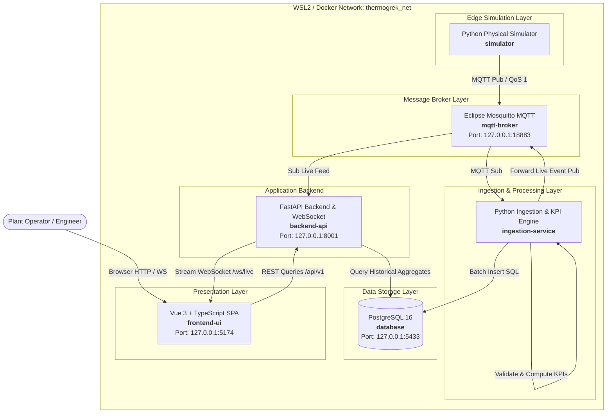

# Phase 6: System Architecture Specification

## 1. Architectural Style & Principles
ThermoGrek follows a **Modular Event-Driven Architecture** containerized via Docker Compose.

Core principles:
1. **Producer-Consumer Decoupling:** Data producers (simulators/sensors) know nothing about downstream consumers (databases, APIs, dashboards). Communication is mediated exclusively via a publish-subscribe broker (MQTT).
2. **Single Responsibility per Service:** Simulation, Ingestion/KPI processing, Storage, and API presentation run in isolated execution contexts.
3. **Localhost Isolation:** All network ingress endpoints bind strictly to `127.0.0.1` to prevent exposure on corporate interfaces (`CDB1.LOCAL`).

---

## 2. Container Architecture Diagram (C4 Model - Level 2)

---

## 3. Data Flow Pathways

### Pathway A: High-Frequency Ingestion & KPI Pipeline (Write Path)
1. **Simulation Engine (`simulator`)** evaluates physical state equations every 1.0 second.
2. Emits JSON payload to topic: `thermogrek/plants/main/assets/{asset_id}/telemetry` via MQTT (QoS 1).
3. **Ingestion Service (`ingestion-service`)** receives payload via persistent MQTT subscription.
4. Ingestion validates schema via Pydantic model (checks fields, data types, physical sanity bounds).
5. Ingestion invokes First-Principles KPI algorithms ($\Delta T$, $\Delta P$, Heat Duty $Q$, Cooling Tower Approach, Health Index).
6. Ingestion commits both raw readings and computed KPIs to **PostgreSQL**.
7. Ingestion publishes computed health/KPI updates to internal topic `thermogrek/plants/main/assets/{asset_id}/kpis` for immediate broadcast.

### Pathway B: Real-Time Operational Streaming (Live Path)
1. **FastAPI Backend (`backend-api`)** listens to the internal live MQTT broadcast topic.
2. Formats lightweight JSON events containing latest telemetry + KPIs.
3. Broadcasts events via active **WebSocket connections** (`/ws/telemetry`) to all connected dashboard browsers with latency $< 200\text{ ms}$.

### Pathway C: Historical & Forensic Querying (Read Path)
1. User in **Frontend (`frontend-ui`)** opens asset trend analysis and selects time range (e.g., Last 24 Hours, 1-minute resolution).
2. Frontend triggers asynchronous HTTP `GET /api/v1/assets/{asset_id}/history?range=24h&resolution=1m`.
3. Backend executes an optimized SQL query utilizing downsampling and indexed timestamp ranges.
4. JSON array returned to frontend; interactive charts render trends without UI freezing.

---

## 4. Port Allocation & Collision-Avoidance Matrix

To avoid all collisions with corporate tools, Hyper-V, and the experimental GLPI environment:

| Service Container | Internal Docker Port | Host Bound Port (Loopback Only) | Justification |
| :--- | :--- | :--- | :--- |
| `mqtt-broker` (Mosquitto) | `1883` | `127.0.0.1:18883` | Default `1883` avoided to prevent collision with local services. |
| `database` (PostgreSQL) | `5432` | `127.0.0.1:5433` | Default `5432` avoided in case host/GLPI uses Postgres. |
| `backend-api` (FastAPI) | `8000` | `127.0.0.1:8001` | Default `8000` avoided; maps to `8001`. |
| `frontend-ui` (Vite/Vue) | `5173` | `127.0.0.1:5174` | Default `5173` avoided; maps to `5174`. |

*Note: Ports `80`, `443`, `3306`, `8080` are completely excluded from ThermoGrek to guarantee zero interference with GLPI.*
