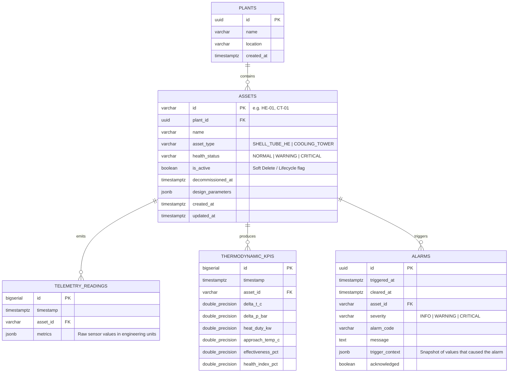

# Phase 8: Physical Data Model Specification (PostgreSQL 16)

## 1. Entity-Relationship Architecture



---

## 2. SQL DDL Schema Definition

```sql
-- Extension for UUID generation
CREATE EXTENSION IF NOT EXISTS "uuid-ossp";

-- 1. Plants Metadata
CREATE TABLE plants (
    id UUID PRIMARY KEY DEFAULT uuid_generate_v4(),
    name VARCHAR(100) NOT NULL,
    location VARCHAR(150),
    created_at TIMESTAMPTZ NOT NULL DEFAULT NOW()
);

-- 2. Assets Metadata (with Soft Delete & Industrial Tag)
CREATE TABLE assets (
    id VARCHAR(50) PRIMARY KEY, -- Industrial Tag (e.g. 'HE-01', 'CT-01')
    plant_id UUID NOT NULL REFERENCES plants(id) ON DELETE CASCADE,
    name VARCHAR(150) NOT NULL,
    asset_type VARCHAR(50) NOT NULL CHECK (asset_type IN ('SHELL_TUBE_HE', 'COOLING_TOWER')),
    health_status VARCHAR(50) NOT NULL DEFAULT 'NORMAL' CHECK (health_status IN ('NORMAL', 'WARNING', 'CRITICAL')),
    is_active BOOLEAN NOT NULL DEFAULT TRUE, -- Soft-delete flag
    decommissioned_at TIMESTAMPTZ,
    design_parameters JSONB NOT NULL DEFAULT '{}'::jsonb,
    created_at TIMESTAMPTZ NOT NULL DEFAULT NOW(),
    updated_at TIMESTAMPTZ NOT NULL DEFAULT NOW()
);

-- 3. High-Frequency Telemetry Readings (Time-Series, Append-Only)
CREATE TABLE telemetry_readings (
    id BIGSERIAL,
    timestamp TIMESTAMPTZ NOT NULL,
    asset_id VARCHAR(50) NOT NULL REFERENCES assets(id) ON DELETE RESTRICT,
    metrics JSONB NOT NULL,
    PRIMARY KEY (asset_id, timestamp, id)
);

-- 4. Calculated Thermodynamic KPIs (Time-Series, Append-Only)
CREATE TABLE thermodynamic_kpis (
    id BIGSERIAL,
    timestamp TIMESTAMPTZ NOT NULL,
    asset_id VARCHAR(50) NOT NULL REFERENCES assets(id) ON DELETE RESTRICT,
    delta_t_c DOUBLE PRECISION,
    delta_p_bar DOUBLE PRECISION,
    heat_duty_kw DOUBLE PRECISION,
    approach_temp_c DOUBLE PRECISION,
    effectiveness_pct DOUBLE PRECISION,
    health_index_pct DOUBLE PRECISION NOT NULL,
    PRIMARY KEY (asset_id, timestamp, id)
);

-- 5. Operational Alarms & Audit Events
CREATE TABLE alarms (
    id UUID PRIMARY KEY DEFAULT uuid_generate_v4(),
    triggered_at TIMESTAMPTZ NOT NULL DEFAULT NOW(),
    cleared_at TIMESTAMPTZ,
    asset_id VARCHAR(50) NOT NULL REFERENCES assets(id) ON DELETE RESTRICT,
    severity VARCHAR(20) NOT NULL CHECK (severity IN ('INFO', 'WARNING', 'CRITICAL')),
    alarm_code VARCHAR(50) NOT NULL,
    message TEXT NOT NULL,
    trigger_context JSONB NOT NULL DEFAULT '{}'::jsonb,
    acknowledged BOOLEAN NOT NULL DEFAULT FALSE
);

-- Indexes for Time-Series Range Queries and Active Alarms
CREATE INDEX idx_telemetry_asset_time ON telemetry_readings (asset_id, timestamp DESC);
CREATE INDEX idx_kpis_asset_time ON thermodynamic_kpis (asset_id, timestamp DESC);
CREATE INDEX idx_alarms_active ON alarms (asset_id, acknowledged) WHERE acknowledged = FALSE;
CREATE INDEX idx_assets_active ON assets (is_active) WHERE is_active = TRUE;
```

---

## 3. Engineering Decisions & Integrity Rules
1. **`ON DELETE RESTRICT` for Telemetry & Alarms:**
   - Notice that while `plant_id` has cascade delete on assets, the foreign keys from telemetry and alarms to `assets` now use `ON DELETE RESTRICT`. This guarantees at the database engine level that no one can accidentally wipe historical sensor records or alarm compliance logs.
2. **Soft-Delete Strategy for Assets:**
   - Decommissioned equipment is marked `is_active = FALSE` and assigned a `decommissioned_at` timestamp. Historical trend queries remain intact forever.
3. **Partial Index on Active Assets:**
   - `idx_assets_active` ensures that normal dashboard queries listing running equipment ignore decommissioned units with zero performance penalty.
